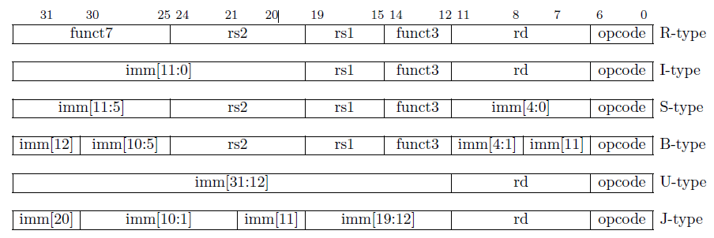

## Bezug zur Aufgabenstellung
Es soll Folgendes realisiert werden:
- Base Instruction Set für 64 Bit ohne compressed (*C*) Instruktionen
- 64-Bit Adressen -> 64 Register

## RISC-V Instruction Set
Unterteilung in:
- das Base Integer Instruction Set und
- ein Set an optionalen Extensions (M, A, F, ...)

### Base Integer Instruction Set
- auch bezeichnet als "**RV32I**" bzw. "**RV64I**"
- für general-purpose computing
- sorgfältig limitiertes minimales Instruktionsset
- besteht aus folgenden Instruktionsarten:
	- integer computational
	- integer loads
	- integer stores
	- control flow

### Instruktionsformate
| Typ    | Beschreibung                                  |
| ------ | --------------------------------------------- |
| R-type | **register-to-register**                      |
| I-type | Operationen mit **Immediate** (12 Bit)        |
| S-type | **Store**-Operationen (reg -> mem)            |
| B-type | **bedingte** Sprünge                          |
| U-type | Operationen mit **großer Immediate** (20 Bit) |
| J-type | **unbedingte** Sprünge                        |

## RISC-V Register File
- bezeichnet die in Menge der in RISC-V benutzten Register
- **Unterteilung** in:
	- Integer Registers
	- Floating-Point Registers (nur vorhanden für implementierte F- oder D-Extension)

### Integer Registers
- 32 Stck. in 32-Bit, 32 Bit breit
- 32 oder 64 Stck. in 64-Bit (je nach Größe des Address Spaces), 64 Bit breit
- Inhalt - Werte im Format ...
	- Boolean
	- 2er-Komplement (signed)
	- unsigned Integer

#### Naming Convention für Integer Register
- x0 als Spezialfall
- x1-x31 als General-Purpose Register, manche mit speziellem Namen zur Zuordnung ihres Zwecks

| Name            | Semantischer Name | Zweck                                                 |
| --------------- | ----------------- | ----------------------------------------------------- |
| x0              | -                 | hardwired zu `0`                                      |
| x1              | ra                | **return** Adresse für Funktionsaufrufe               |
| x2              | sp                | **Stack** Pointer                                     |
| x3              | gp                | **Global** Pointer (global data)                      |
| x4              | tp                | **Thread** Pointer (thread-lokaler Speicher)          |
| x5-x11          | t0-t6             | **temporäre** Register                                |
| x10-x17         | a0-a7             | Register für **Funktionsargumente**                   |
| x8, x9, x18-x27 | s0-s11            | "Saved" Register für Werte zwischen Funktionsaufrufen |
| x28-x31         | t3-t6             | weitere **temporäre** Register                        |

## RISC-V Privilege Levels
- *unprivileged* Instruktionen: können von jeder auf dem Prozessor laufenden Software ausgeführt werden, greifen auf keine sensiblen System-Ressourcen zu
- *privileged* Instruktionen: sollen nur vom OS oder Kernel ausgeführt werden, zum Verwalten von System-Ressourcen, auch zum Verwalten externer Geräte
- in RISC-V werden 3 Privilege Levels verwendet:
	- machine mode
	- supervisor mode
	- user mode

### Machine Mode (M-Mode)
- höchster Privilege, **uneingeschränkter Zugriff** auf alle Prozessor-Ressourcen und Systemfunktionen
- Prozessor kann auf **alle Register**, **Memory Locations** und **Control Register** zugreifen und **jede Instruktion** ausführen

### Supervisor Mode (S-Mode)
- mittlerer (dazwischenliegender) Privilege-Mode
- z.B. für OSs
- eingeschränkter Zugriff auf bestimmte Ressourcen und Funktionen

### User Mode (U-Mode)
- niedrigster Privilege
- eingeschränkter Zugriff auf Ressourcen und Funktionen, die von (der) Supervisor-Mode Software kontrolliert wird

## Execution Environment (EE)
- Verhalten eines RISC-V Programms ist abhängig vom Execution Environment in dem es läuft
- Execution Environment Interface (EEI) definiert:
	- initialen Programmzustand
	- Anzahl und Art der Harts (Hardware Threads) samt ihrer Privilege Modi
	- Accessiblity und Attribute des Memory und I/O
	- Verhalten aller legalen Instruktionen in jedem Hart
	- Interrupt- und Exception-Handling

## Memory
- Byte-addressierbarer Adressraum von $2^{XLEN}$ Bytes
- Speicher-*Wort*: 32 bits
- zirkulärer Speicher, d.h. Byte an Adresse $2^{XLEN} - 1$ ist angrenzend zu Byte an Adresse 0
- alle Adressberechnungen werden folglich modulo $2^{XLEN}$ durchgeführt
- Mapping von Hardware Resourcen in den Adressraum eines Harts durch EE
- Teil des Adressraums von Harts kann sein:
	1. leer
	2. Hauptspeicherelemente
	3. I/O-Geräte
- Harts können Addressräume (ganz oder teilweise) teilen

## Exceptions, Interrupts & Traps
- *Exception* ... eine unübliche Bedingung, die zur Laufzeit in Verbindung mit einer Instruction im aktuellen Hart auftritt, können durch Instruktionen ausgelöst werden
- *Interrupt* ... externes asynchrones Ereignis, das bei einem Hart zu einem unerwarteten Transfer od Control führen kann
- *Trap* ... Transfer of Control an einen Trap Handler, ausgelöst entweder von einer Exception oder einem Interrupt

### Trap Handling
- Handling sowie Sichtbarkeit des Auftretens für die Software abhängig von EE
- 4 mögliche Effekte durch Traps:
	- **Contained** Trap: für Software sichtbar und von ihr gehandlet
	- **Requested** Trap: sychrone Exception, expliziter Aufruf an Software in EE -> z.B. System Call
	- **Invisible** Trap: EE handlet Trap, Software bekommt nichts vom Trap mit-> z.B. Page Fault Handling in einem System mit virtuellem Speicher
	- **Fatal** Trap: Fataler Fehler, EE terminiert

|                         | Contained | Requested | Invisible | Fatal |
| ----------------------- | --------- | --------- | --------- | ----- |
| Ausführung terminiert?  | N         | N         | N         | J     |
| Software weiß Bescheid? | J         | J         | N         | N     |
| Gehandlet durch EE?     | N         | J         | J         | J     |